<h1 align="center"> 👋 Hey, I'm Ishav</h1>
<h3 align="center">A passionate software developer</h3>

  

- 4th Year Computer Science Student at **UofT**

- I am a hardworking individual who is committed to going above and beyond to consistently exceed targets.

- I am a reliable team member accustomed to taking on challenging tasks, and who is capable of adapting to varying situations and environments. 

- I am interested in **Web Development** and **Full Stack Software Development**

- I’m looking to collaborate on **full stack web apps!**

- 📫 How to reach me **ishavsohal1@gmail.com**

<h3 align="left">Connect with me:</h3>

<h3 align="left">Languages and Tools:</h3>

 
   
   
   
   
   
   
   
   
   
   
   
   
   
   
   
   
   
   

<!-- 

 

 -->
